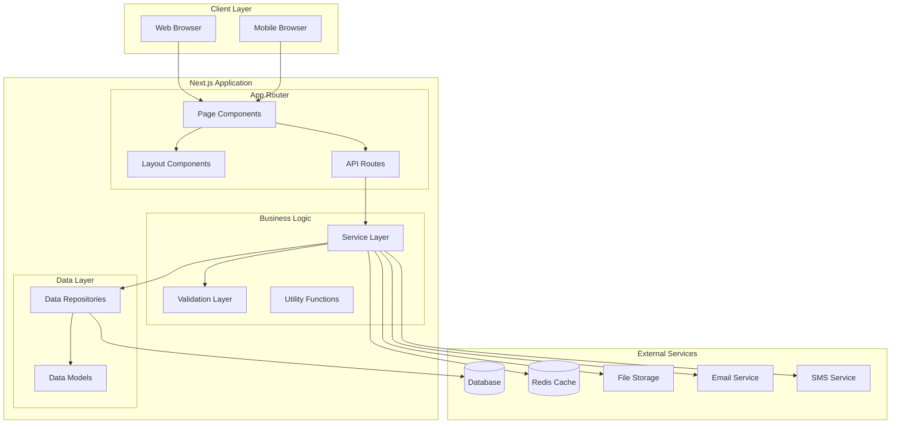

# Design Document: LSO Logistics Carrier System

## Overview

The LSO (Logistics Service Operations) system is a modern, full-stack web application built with Next.js 14 that provides comprehensive logistics and carrier services to customers. The system architecture follows a component-based design pattern with clear separation of concerns between presentation, business logic, and data layers.

The application leverages Next.js App Router for routing and server-side rendering, React Server Components for optimal performance, and TypeScript for type safety. The UI is built with Tailwind CSS and shadcn/ui components, ensuring a consistent, accessible, and responsive user experience across all devices.

Key architectural principles:
- **Server-First Architecture**: Utilize React Server Components for data fetching and rendering where possible
- **Progressive Enhancement**: Core functionality works without JavaScript, enhanced with client-side interactivity
- **Type Safety**: End-to-end TypeScript coverage from frontend to API routes
- **Internationalization**: Built-in i18n support with next-intl for Chinese and English
- **Performance**: Code splitting, lazy loading, and optimized asset delivery
- **Security**: Authentication, authorization, input validation, and CSRF protection

## Architecture

### High-Level Architecture



### Directory Structure

```
lso-system/
├── app/                          # Next.js App Router
│   ├── [locale]/                 # Internationalized routes
│   │   ├── (auth)/              # Auth group (login, register)
│   │   │   ├── login/
│   │   │   └── register/
│   │   ├── (dashboard)/         # Dashboard group (authenticated)
│   │   │   ├── layout.tsx       # Dashboard layout with sidebar
│   │   │   ├── page.tsx         # Dashboard home
│   │   │   ├── shipments/       # Shipment management
│   │   │   ├── tracking/        # Tracking pages
│   │   │   ├── booking/         # Create shipments
│   │   │   ├── address-book/    # Address management
│   │   │   ├── history/         # Shipping history
│   │   │   ├── invoices/        # Invoice management
│   │   │   └── settings/        # User preferences
│   │   ├── (public)/            # Public group (no auth)
│   │   │   ├── services/        # Service capabilities
│   │   │   ├── rates/           # Rate calculator
│   │   │   ├── track/           # Public tracking
│   │   │   └── help/            # Help center
│   │   └── layout.tsx           # Root layout
│   ├── api/                     # API routes
│   │   ├── auth/                # Authentication endpoints
│   │   ├── shipments/           # Shipment CRUD
│   │   ├── tracking/            # Tracking endpoints
│   │   ├── rates/               # Rate calculation
│   │   ├── addresses/           # Address book CRUD
│   │   └── notifications/       # Notification management
│   └── globals.css              # Global styles
├── components/                   # React components
│   ├── ui/                      # shadcn/ui components
│   ├── forms/                   # Form components
│   ├── tables/                  # Data table components
│   ├── layout/                  # Layout components
│   │   ├── Header.tsx
│   │   ├── Sidebar.tsx
│   │   └── Footer.tsx
│   └── features/                # Feature-specific components
│       ├── tracking/
│       ├── booking/
│       ├── rates/
│       └── services/
├── lib/                         # Business logic and utilities
│   ├── services/                # Service layer
│   │   ├── shipment.service.ts
│   │   ├── tracking.service.ts
│   │   ├── rate.service.ts
│   │   ├── auth.service.ts
│   │   └── notification.service.ts
│   ├── repositories/            # Data access layer
│   │   ├── shipment.repository.ts
│   │   ├── user.repository.ts
│   │   └── address.repository.ts
│   ├── validators/              # Input validation
│   │   ├── shipment.validator.ts
│   │   ├── address.validator.ts
│   │   └── auth.validator.ts
│   ├── utils/                   # Utility functions
│   │   ├── format.ts
│   │   ├── date.ts
│   │   └── currency.ts
│   └── db/                      # Database configuration
│       ├── client.ts
│       └── schema.ts
├── types/                       # TypeScript type definitions
│   ├── shipment.ts
│   ├── user.ts
│   ├── address.ts
│   └── api.ts
├── messages/                    # i18n translation files
│   ├── en.json
│   └── zh.json
├── public/                      # Static assets
│   ├── images/
│   └── icons/
└── middleware.ts                # Next.js middleware (auth, i18n)
```

### Technology Stack

**Frontend:**
- Next.js 14 (App Router, React Server Components)
- React 18 (Client components for interactivity)
- TypeScript 5 (Type safety)
- Tailwind CSS 3 (Styling)
- shadcn/ui (UI component library)
- next-intl (Internationalization)
- React Hook Form (Form management)
- Zod (Schema validation)

**Backend:**
- Next.js API Routes (RESTful API)
- Prisma (ORM for database access)
- PostgreSQL (Primary database)
- Redis (Caching and session storage)
- NextAuth.js (Authentication)

**Development Tools:**
- ESLint (Code linting)
- Prettier (Code formatting)
- Vitest (Unit testing)
- Playwright (E2E testing)
- fast-check (Property-based testing)

## Components and Interfaces

### Core Components

#### 1. Layout Components

**Header Component**
```typescript
interface HeaderProps {
  locale: string;
  user?: User | null;
}

// Displays logo, navigation, language selector, and user menu
// Responsive: full menu on desktop, hamburger on mobile
```

**Sidebar Component**
```typescript
interface SidebarProps {
  locale: string;
  currentPath: string;
  isOpen: boolean;
  onClose: () => void;
}

// Navigation sidebar for dashboard
// Collapsible on tablet/mobile
// Highlights active route
```

**Footer Component**
```typescript
interface FooterProps {
  locale: string;
}

// Displays links, contact info, and legal information
```

#### 2. Feature Components

**TrackingForm Component**
```typescript
interface TrackingFormProps {
  onSubmit: (trackingNumbers: string[]) => Promise<void>;
  locale: string;
}

// Input for tracking numbers (single or batch)
// Validates format before submission
// Supports tracking by reference number
```

**TrackingResults Component**
```typescript
interface TrackingResultsProps {
  results: TrackingResult[];
  locale: string;
}

interface TrackingResult {
  trackingNumber: string;
  status: ShipmentStatus;
  currentLocation: string;
  estimatedDelivery: Date;
  history: TrackingEvent[];
  deliveryProof?: DeliveryProof;
}

// Displays tracking information in timeline format
// Shows delivery proof when available
// Responsive card layout
```

**RateCalculator Component**
```typescript
interface RateCalculatorProps {
  onCalculate: (params: RateParams) => Promise<RateResult[]>;
  locale: string;
}

interface RateParams {
  origin: Address;
  destination: Address;
  packages: Package[];
  additionalServices: string[];
}

interface RateResult {
  serviceType: string;
  serviceName: string;
  baseRate: number;
  additionalCharges: number;
  totalCost: number;
  estimatedTransitDays: number;
  currency: string;
}

// Form for entering shipment details
// Real-time validation
// Displays comparison table of rates
```

**BookingForm Component**
```typescript
interface BookingFormProps {
  onSubmit: (booking: BookingData) => Promise<Shipment>;
  savedAddresses: Address[];
  locale: string;
}

interface BookingData {
  origin: Address;
  destination: Address;
  packages: Package[];
  serviceType: string;
  additionalServices: string[];
  pickupDate?: Date;
  referenceNumber?: string;
  specialInstructions?: string;
}

// Multi-step form for creating shipments
// Address book integration
// Package details with validation
// Service selection
// Pickup scheduling
```

**DataTable Component**
```typescript
interface DataTableProps<T> {
  data: T[];
  columns: ColumnDef<T>[];
  searchable?: boolean;
  filterable?: boolean;
  sortable?: boolean;
  pagination?: PaginationConfig;
  locale: string;
}

interface ColumnDef<T> {
  key: keyof T;
  header: string;
  sortable?: boolean;
  filterable?: boolean;
  render?: (value: any, row: T) => React.ReactNode;
}

// Reusable table with sorting, filtering, pagination
// Used for shipping history, address book, invoices
// Responsive: cards on mobile, table on desktop
```

**AddressBook Component**
```typescript
interface AddressBookProps {
  addresses: Address[];
  onAdd: (address: Address) => Promise<void>;
  onEdit: (id: string, address: Address) => Promise<void>;
  onDelete: (id: string) => Promise<void>;
  onSelect?: (address: Address) => void;
  locale: string;
}

// CRUD operations for addresses
// Search and filter functionality
// Selection mode for booking integration
```

#### 3. Form Components

**FormField Component**
```typescript
interface FormFieldProps {
  name: string;
  label: string;
  type: 'text' | 'email' | 'tel' | 'number' | 'select' | 'textarea';
  placeholder?: string;
  required?: boolean;
  validation?: ValidationRule[];
  error?: string;
  locale: string;
}

// Reusable form field with validation
// Real-time error display
// Accessible labels and ARIA attributes
```

**AddressInput Component**
```typescript
interface AddressInputProps {
  value: Address;
  onChange: (address: Address) => void;
  countries: Country[];
  locale: string;
}

// Composite component for address entry
// Country-specific postal code validation
// Optional address autocomplete
```

### Service Layer

#### ShipmentService

```typescript
class ShipmentService {
  // Create a new shipment
  async createShipment(data: BookingData, userId: string): Promise<Shipment> {
    // 1. Validate booking data
    // 2. Calculate rates
    // 3. Generate tracking number
    // 4. Create shipment record
    // 5. Generate label
    // 6. Schedule pickup if requested
    // 7. Send confirmation notification
    // 8. Return shipment with tracking number
  }

  // Get shipment by tracking number
  async getShipmentByTracking(trackingNumber: string): Promise<Shipment | null> {
    // 1. Validate tracking number format
    // 2. Query database
    // 3. Return shipment or null
  }

  // Get shipments by reference number
  async getShipmentsByReference(referenceNumber: string, userId: string): Promise<Shipment[]> {
    // 1. Query database for user's shipments with reference
    // 2. Return array of shipments
  }

  // Update shipment status
  async updateShipmentStatus(
    trackingNumber: string,
    status: ShipmentStatus,
    location: string
  ): Promise<void> {
    // 1. Update shipment status
    // 2. Add tracking event
    // 3. Trigger notification if configured
  }

  // Get shipment history for user
  async getShipmentHistory(
    userId: string,
    filters: ShipmentFilters,
    pagination: PaginationParams
  ): Promise<PaginatedResult<Shipment>> {
    // 1. Build query with filters
    // 2. Apply pagination
    // 3. Return paginated results
  }

  // Generate shipping label
  async generateLabel(trackingNumber: string): Promise<Buffer> {
    // 1. Get shipment details
    // 2. Generate barcode
    // 3. Create PDF with label template
    // 4. Return PDF buffer
  }
}
```

#### TrackingService

```typescript
class TrackingService {
  // Track shipment by tracking number
  async trackByNumber(trackingNumber: string): Promise<TrackingResult> {
    // 1. Validate tracking number
    // 2. Get shipment from database
    // 3. Get tracking events
    // 4. Get delivery proof if delivered
    // 5. Format and return tracking result
  }

  // Track multiple shipments (batch)
  async trackBatch(trackingNumbers: string[]): Promise<TrackingResult[]> {
    // 1. Validate all tracking numbers
    // 2. Query database for all shipments
    // 3. Return results (including not found)
  }

  // Track by reference number
  async trackByReference(referenceNumber: string): Promise<TrackingResult[]> {
    // 1. Find all shipments with reference
    // 2. Get tracking info for each
    // 3. Return array of results
  }

  // Add tracking event
  async addTrackingEvent(
    trackingNumber: string,
    event: TrackingEventData
  ): Promise<void> {
    // 1. Validate event data
    // 2. Create tracking event record
    // 3. Update shipment current status
    // 4. Trigger notifications if needed
  }
}
```

#### RateService

```typescript
class RateService {
  // Calculate rates for shipment
  async calculateRates(params: RateParams): Promise<RateResult[]> {
    // 1. Validate origin and destination
    // 2. Check service coverage
    // 3. Calculate dimensional weight
    // 4. Get base rates for each service type
    // 5. Calculate additional service charges
    // 6. Apply any discounts
    // 7. Return sorted rate results
  }

  // Check service coverage
  async checkCoverage(origin: Address, destination: Address): Promise<ServiceType[]> {
    // 1. Validate addresses
    // 2. Query coverage database
    // 3. Return available service types
  }

  // Calculate dimensional weight
  calculateDimensionalWeight(dimensions: Dimensions): number {
    // (Length × Width × Height) / Dimensional Factor
    // Return greater of actual weight or dimensional weight
  }
}
```

#### AuthService

```typescript
class AuthService {
  // Register new user
  async register(data: RegisterData): Promise<User> {
    // 1. Validate registration data
    // 2. Check if email already exists
    // 3. Hash password
    // 4. Create user record
    // 5. Send verification email
    // 6. Return user (without password)
  }

  // Authenticate user
  async login(email: string, password: string): Promise<AuthResult> {
    // 1. Find user by email
    // 2. Verify password
    // 3. Check account status
    // 4. Generate session token
    // 5. Return token and user info
  }

  // Verify session token
  async verifyToken(token: string): Promise<User | null> {
    // 1. Decode and validate token
    // 2. Check expiration
    // 3. Get user from database
    // 4. Return user or null
  }

  // Logout user
  async logout(token: string): Promise<void> {
    // 1. Invalidate token in cache
    // 2. Clear session
  }
}
```

#### NotificationService

```typescript
class NotificationService {
  // Send notification
  async sendNotification(
    userId: string,
    type: NotificationType,
    data: NotificationData
  ): Promise<void> {
    // 1. Get user notification preferences
    // 2. Check if user wants this notification type
    // 3. Format message based on locale
    // 4. Send via configured channels (email, SMS)
  }

  // Update notification preferences
  async updatePreferences(
    userId: string,
    preferences: NotificationPreferences
  ): Promise<void> {
    // 1. Validate preferences
    // 2. Update user preferences
  }

  // Get notification history
  async getNotificationHistory(
    userId: string,
    pagination: PaginationParams
  ): Promise<PaginatedResult<Notification>> {
    // 1. Query notification history
    // 2. Apply pagination
    // 3. Return results
  }
}
```

### Validation Layer

#### Validators

```typescript
// Shipment validation
const shipmentSchema = z.object({
  origin: addressSchema,
  destination: addressSchema,
  packages: z.array(packageSchema).min(1).max(50),
  serviceType: z.enum(['express', 'freight', 'international', 'special']),
  additionalServices: z.array(z.string()).optional(),
  pickupDate: z.date().min(new Date(Date.now() + 24 * 60 * 60 * 1000)).optional(),
  referenceNumber: z.string().max(50).optional(),
  specialInstructions: z.string().max(500).optional(),
});

// Address validation
const addressSchema = z.object({
  name: z.string().min(1).max(100),
  company: z.string().max(100).optional(),
  street1: z.string().min(1).max(100),
  street2: z.string().max(100).optional(),
  city: z.string().min(1).max(50),
  state: z.string().max(50).optional(),
  postalCode: z.string().min(1).max(20),
  country: z.string().length(2), // ISO country code
  phone: z.string().regex(/^\+?[1-9]\d{1,14}$/), // E.164 format
  email: z.string().email().optional(),
});

// Package validation
const packageSchema = z.object({
  length: z.number().positive().max(300), // cm
  width: z.number().positive().max(300),
  height: z.number().positive().max(300),
  weight: z.number().min(0.1).max(1000), // kg
  description: z.string().min(1).max(200),
  value: z.number().positive().optional(),
  currency: z.string().length(3).optional(), // ISO currency code
});

// User registration validation
const registerSchema = z.object({
  email: z.string().email(),
  password: z.string().min(8).max(100)
    .regex(/[A-Z]/, 'Must contain uppercase letter')
    .regex(/[a-z]/, 'Must contain lowercase letter')
    .regex(/[0-9]/, 'Must contain number'),
  firstName: z.string().min(1).max(50),
  lastName: z.string().min(1).max(50),
  phone: z.string().regex(/^\+?[1-9]\d{1,14}$/),
  company: z.string().max(100).optional(),
});

// Tracking number validation
function validateTrackingNumber(trackingNumber: string): boolean {
  // LSO tracking numbers: LSO + 10 digits + check digit
  const pattern = /^LSO\d{10}[0-9]$/;
  if (!pattern.test(trackingNumber)) return false;
  
  // Validate check digit using Luhn algorithm
  return validateCheckDigit(trackingNumber);
}

function validateCheckDigit(trackingNumber: string): boolean {
  const digits = trackingNumber.slice(3); // Remove "LSO" prefix
  // Implement Luhn algorithm for check digit validation
  // ... implementation details
  return true; // placeholder
}
```

## Data Models

### Core Data Models

```typescript
// User model
interface User {
  id: string;
  email: string;
  passwordHash: string;
  firstName: string;
  lastName: string;
  phone: string;
  company?: string;
  locale: 'en' | 'zh';
  preferences: UserPreferences;
  createdAt: Date;
  updatedAt: Date;
}

interface UserPreferences {
  defaultOriginAddressId?: string;
  defaultServiceType?: string;
  defaultPackageType?: string;
  measurementUnit: 'metric' | 'imperial';
  dateFormat: 'MM/DD/YYYY' | 'DD/MM/YYYY';
  notifications: NotificationPreferences;
}

interface NotificationPreferences {
  email: boolean;
  sms: boolean;
  events: {
    pickupScheduled: boolean;
    inTransit: boolean;
    outForDelivery: boolean;
    delivered: boolean;
    exception: boolean;
  };
}

// Shipment model
interface Shipment {
  id: string;
  trackingNumber: string;
  userId: string;
  referenceNumber?: string;
  status: ShipmentStatus;
  serviceType: ServiceType;
  origin: Address;
  destination: Address;
  packages: Package[];
  additionalServices: string[];
  pickupDate?: Date;
  pickupTimeSlot?: string;
  specialInstructions?: string;
  estimatedDelivery?: Date;
  actualDelivery?: Date;
  totalCost: number;
  currency: string;
  labelUrl?: string;
  createdAt: Date;
  updatedAt: Date;
}

enum ShipmentStatus {
  DRAFT = 'draft',
  PENDING_PICKUP = 'pending_pickup',
  PICKED_UP = 'picked_up',
  IN_TRANSIT = 'in_transit',
  OUT_FOR_DELIVERY = 'out_for_delivery',
  DELIVERED = 'delivered',
  EXCEPTION = 'exception',
  CANCELLED = 'cancelled',
}

enum ServiceType {
  EXPRESS = 'express',
  FREIGHT = 'freight',
  INTERNATIONAL = 'international',
  SPECIAL = 'special',
}

// Address model
interface Address {
  id?: string;
  userId?: string;
  name: string;
  company?: string;
  street1: string;
  street2?: string;
  city: string;
  state?: string;
  postalCode: string;
  country: string; // ISO 3166-1 alpha-2
  phone: string;
  email?: string;
  isDefault?: boolean;
  createdAt?: Date;
  updatedAt?: Date;
}

// Package model
interface Package {
  id?: string;
  length: number; // cm
  width: number;
  height: number;
  weight: number; // kg
  description: string;
  value?: number;
  currency?: string;
  dimensionalWeight?: number;
}

// Tracking event model
interface TrackingEvent {
  id: string;
  shipmentId: string;
  trackingNumber: string;
  status: ShipmentStatus;
  location: string;
  description: string;
  timestamp: Date;
  createdAt: Date;
}

// Delivery proof model
interface DeliveryProof {
  id: string;
  shipmentId: string;
  trackingNumber: string;
  deliveredAt: Date;
  recipientName: string;
  signature?: string; // Base64 encoded image
  photo?: string; // URL to photo
  notes?: string;
  createdAt: Date;
}

// Invoice model
interface Invoice {
  id: string;
  invoiceNumber: string;
  userId: string;
  shipmentIds: string[];
  subtotal: number;
  tax: number;
  total: number;
  currency: string;
  status: InvoiceStatus;
  dueDate: Date;
  paidAt?: Date;
  createdAt: Date;
  updatedAt: Date;
}

enum InvoiceStatus {
  PENDING = 'pending',
  PAID = 'paid',
  OVERDUE = 'overdue',
  CANCELLED = 'cancelled',
}

// Pickup request model
interface PickupRequest {
  id: string;
  userId: string;
  shipmentIds: string[];
  address: Address;
  pickupDate: Date;
  timeSlot: string;
  specialInstructions?: string;
  status: PickupStatus;
  createdAt: Date;
  updatedAt: Date;
}

enum PickupStatus {
  SCHEDULED = 'scheduled',
  CONFIRMED = 'confirmed',
  IN_PROGRESS = 'in_progress',
  COMPLETED = 'completed',
  CANCELLED = 'cancelled',
}

// Notification model
interface Notification {
  id: string;
  userId: string;
  type: NotificationType;
  channel: 'email' | 'sms';
  subject: string;
  message: string;
  data: Record<string, any>;
  sentAt: Date;
  readAt?: Date;
  createdAt: Date;
}

enum NotificationType {
  PICKUP_SCHEDULED = 'pickup_scheduled',
  IN_TRANSIT = 'in_transit',
  OUT_FOR_DELIVERY = 'out_for_delivery',
  DELIVERED = 'delivered',
  EXCEPTION = 'exception',
  INVOICE_GENERATED = 'invoice_generated',
}
```

### Database Schema (Prisma)

```prisma
model User {
  id            String    @id @default(cuid())
  email         String    @unique
  passwordHash  String
  firstName     String
  lastName      String
  phone         String
  company       String?
  locale        String    @default("en")
  preferences   Json      @default("{}")
  createdAt     DateTime  @default(now())
  updatedAt     DateTime  @updatedAt
  
  shipments     Shipment[]
  addresses     Address[]
  pickups       PickupRequest[]
  notifications Notification[]
  invoices      Invoice[]
  
  @@index([email])
}

model Shipment {
  id                  String         @id @default(cuid())
  trackingNumber      String         @unique
  userId              String
  referenceNumber     String?
  status              String
  serviceType         String
  origin              Json
  destination         Json
  packages            Json
  additionalServices  Json           @default("[]")
  pickupDate          DateTime?
  pickupTimeSlot      String?
  specialInstructions String?
  estimatedDelivery   DateTime?
  actualDelivery      DateTime?
  totalCost           Float
  currency            String         @default("USD")
  labelUrl            String?
  createdAt           DateTime       @default(now())
  updatedAt           DateTime       @updatedAt
  
  user                User           @relation(fields: [userId], references: [id])
  trackingEvents      TrackingEvent[]
  deliveryProof       DeliveryProof?
  
  @@index([userId])
  @@index([trackingNumber])
  @@index([referenceNumber])
  @@index([status])
  @@index([createdAt])
}

model Address {
  id         String    @id @default(cuid())
  userId     String
  name       String
  company    String?
  street1    String
  street2    String?
  city       String
  state      String?
  postalCode String
  country    String
  phone      String
  email      String?
  isDefault  Boolean   @default(false)
  createdAt  DateTime  @default(now())
  updatedAt  DateTime  @updatedAt
  
  user       User      @relation(fields: [userId], references: [id])
  
  @@index([userId])
}

model TrackingEvent {
  id             String    @id @default(cuid())
  shipmentId     String
  trackingNumber String
  status         String
  location       String
  description    String
  timestamp      DateTime
  createdAt      DateTime  @default(now())
  
  shipment       Shipment  @relation(fields: [shipmentId], references: [id])
  
  @@index([shipmentId])
  @@index([trackingNumber])
  @@index([timestamp])
}

model DeliveryProof {
  id             String    @id @default(cuid())
  shipmentId     String    @unique
  trackingNumber String
  deliveredAt    DateTime
  recipientName  String
  signature      String?
  photo          String?
  notes          String?
  createdAt      DateTime  @default(now())
  
  shipment       Shipment  @relation(fields: [shipmentId], references: [id])
  
  @@index([trackingNumber])
}

model PickupRequest {
  id                  String    @id @default(cuid())
  userId              String
  shipmentIds         Json
  address             Json
  pickupDate          DateTime
  timeSlot            String
  specialInstructions String?
  status              String
  createdAt           DateTime  @default(now())
  updatedAt           DateTime  @updatedAt
  
  user                User      @relation(fields: [userId], references: [id])
  
  @@index([userId])
  @@index([pickupDate])
  @@index([status])
}

model Invoice {
  id            String    @id @default(cuid())
  invoiceNumber String    @unique
  userId        String
  shipmentIds   Json
  subtotal      Float
  tax           Float
  total         Float
  currency      String    @default("USD")
  status        String
  dueDate       DateTime
  paidAt        DateTime?
  createdAt     DateTime  @default(now())
  updatedAt     DateTime  @updatedAt
  
  user          User      @relation(fields: [userId], references: [id])
  
  @@index([userId])
  @@index([invoiceNumber])
  @@index([status])
}

model Notification {
  id        String    @id @default(cuid())
  userId    String
  type      String
  channel   String
  subject   String
  message   String
  data      Json      @default("{}")
  sentAt    DateTime
  readAt    DateTime?
  createdAt DateTime  @default(now())
  
  user      User      @relation(fields: [userId], references: [id])
  
  @@index([userId])
  @@index([type])
  @@index([sentAt])
}
```

